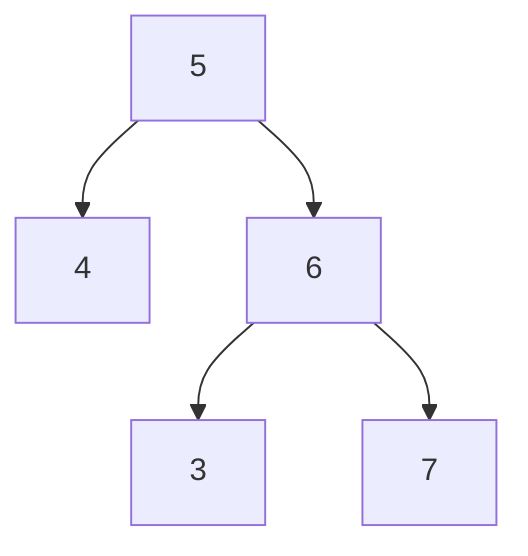

下面是 **2/1–2/7（第一周）力扣题单式“每日 2–3 题”具体规划**：按「**数组/哈希 → 前缀和 → 双指针 → 滑窗 → 二分**」递进，保证你一周内把高频基础题型的**识别 + 模板 + 边界**找回来。

> 每天建议：**第1题热身(简单/基础Medium) → 第2题主练(Medium) → 第3题可选(同类变体/偏难/复盘)**
> 每天最后 10 分钟：写 3 行复盘（题型信号 / 模板关键点 / 易错点）。

---
# Week 1


## 第一周力扣刷题计划

> 规则：每天 **2 题必做 + 1 题可选**
> 提示类语句（如“太难就跳过/换复盘”）保留在计划里

| 日期  | 必做 1                   | 必做 2                  | 可选（第 3 题）     | 备注                                       |
| --- |------------------------| --------------------- | ------------- | ---------------------------------------- |
| 2/1 | :heavy_check_mark:**两数之和** | :heavy_check_mark:存在重复元素                | :heavy_check_mark:有效的字母异位词      |                                          |
| 2/2 | :heavy_check_mark: **:heavy_check_mark:和为 K 的子数组** | :heavy_check_mark:区域和检索 - 数组不可变         | 除自身以外数组的乘积    |                                          |
| 2/3 | :heavy_check_mark:移动零                    | :heavy_check_mark: **:heavy_check_mark: 合并两个有序数组** | :heavy_check_mark:有序数组的平方       |                                          |
| 2/4 | :heavy_check_mark: **盛最多水的容器** | :heavy_check_mark:**三数之和** | :heavy_check_mark: **接雨水** | 第一题难在证明解法是正确的；第二题难在去重（复用两数之和思路）、双指针思路比较难想 |
| 2/5 | :heavy_check_mark: 无重复字符的最长子串 | :heavy_check_mark:长度最小的子数组 | :heavy_check_mark:找到字符串中所有字母异位词 |                                          |
| 2/6 | :heavy_check_mark:字符串的排列 | :heavy_check_mark:最小覆盖子串 | （无）           | **如果最小覆盖子串太难：今天只做“字符串的排列 + 复盘错题”也完全 OK** |
| 2/7 | :heavy_check_mark:搜索插入位置 | :heavy_check_mark:在排序数组中查找元素的第一个和最后一个位置 | 爱吃香蕉的珂珂       |                                          |

---


> ✅建议你这一周先别看这里；等 2/7 做完后再回来看，对照补漏。

## A) 每日题目对应的“题型标签”（帮助你复盘归类）

* 2/1：哈希表 / 集合
* 2/2：前缀和 + 哈希表
* 2/3：双指针（快慢/原地）
* 2/4：双指针（左右夹逼）+ 去重 /（可选）进阶
* 2/5：滑动窗口（不定长 / 固定长）
* 2/6：滑动窗口进阶（计数匹配）
* 2/7：二分（边界二分 / 答案二分）

---

## 反思与总结

### Day3

#### 三数之和

**1.两数之和**

此题很容易想到复用两数之和的解法。但难点在于不输出重复的组合。

对于去重

- 首先想到将结果加入到一个set中，但这样做每次都要维护set，同样耗时。只能从遍历的方法上想办法，在遍历时就争取不把重复的元素加入结果中
- 想到先排序是一个关键
- 排序后，对于第一个元素i，对后面的元素【i+1，n】应用两数之和的方法。随后就可以直接跳过所有与i相同的元素
- 应用两数之和的方法时，内部也要去重。方法是：对于游标j，在map中找到target后，就一直j++，直到到下一个不重复的元素


**2. 双指针**

这里直接引用题解

> 当我们需要枚举数组中的两个元素时，如果我们发现随着第一个元素的递增，第二个元素是递减的，那么就可以使用双指针的方法，将枚举的时间复杂度从 O(N^2) 减少至 O(N)
>


### Day 4

#### 接雨水

此题的难点在于分析出：

> 对于i这一列，水的高度，必须不高于：
>
> - 左侧能提供的最高挡板高度
> - 右侧能提供的最高挡板高度

这一事实

因此这个问题就变成了求解每个`i`处的水位，然后累加。进而转变成：求每个i左边和右边的柱子的最大值，然后取最小者。有点类似于动态规划的思想

而不是像之前一样从**”整体“**去考虑，比如说在一串数字中找出两个数、三个数这种


一个很容易产生的思维陷阱就是：找到一个可能存住雨水的**区间**，然后去计算这个区间里可以存多少雨水。

这也是一种整体的思想，但实际上这种思路很难找到所有区间，要考虑的特殊情况很多；即使成功找到，花费的复杂度肯定也很高

---

**为什么`height[start] < height[end]`写也对？**

`if (leftMax <= rightMax)` 是“直接在比 min 的两边”，而 `if (height[l] < height[r])` 看起来只比了当前两根柱子，为什么也能对？

结论先说清：**它们不是严格“每一步完全等价”的判断条件**（并不保证同一轮会选同一边），但两者都能保证：**你选择结算的那一侧，其水位上限已经确定，不会算错**，所以都正确。

你这个点问得非常到位：
`if (leftMax <= rightMax)` 是“直接在比 min 的两边”，而 `if (height[l] < height[r])` 看起来只比了当前两根柱子，为什么也能对？

结论先说清：**它们不是严格“每一步完全等价”的判断条件**（并不保证同一轮会选同一边），但两者都能保证：**你选择结算的那一侧，其水位上限已经确定，不会算错**，所以都正确。

下面把“为什么 `height[l] < height[r]` 也安全”讲透。

------

**1）双指针正确性的核心：结算时必须“知道 min 是谁”**

结算左侧 `l` 时，我们需要能断言：
[
\min(\text{maxLeft at }l,\ \text{maxRight at }l) = leftMax
]
也就是我们需要**确认右侧最高挡板**足够高，至少不比 `leftMax` 更矮，否则 min 可能是右边，不能用 `leftMax` 结算。

同理结算右侧 `r` 时，需要确认左侧最高挡板足够高，能让 min 变成 `rightMax`。

------

**2）`height[l] < height[r]` 为什么能让“结算左边”变得安全？**

关键事实：当 `height[l] < height[r]` 时，**右侧当前就存在一根柱子高度 ≥ height[l]**（就是 `height[r]`）。
因此，对于位置 `l` 来说：

- 右边至少有一个挡板高度 ≥ `height[l]`
- 所以位置 `l` 能不能存水，取决于左侧能不能把水位抬高（`leftMax`）

更严格一点分两种情况看：

**情况 A：`leftMax == height[l]`**

说明左边到目前为止最高就是自己，那
[
leftMax - height[l] = 0
]

这时候无论右边最高有多高，结算 0 都永远不会错。

**情况 B：`leftMax > height[l]`**

这意味着左边确实有更高的墙，左侧能把水位抬到 `leftMax`。
那我们担心的是：右边会不会太矮导致水位其实被右边卡住？

注意：我们并不需要右边最高立刻 ≥ `leftMax` 才能移动 `l`，因为算法的推进方式保证了：

- 如果右边整体不够高（`rightMax < leftMax`），那么右侧会成为“更紧的瓶颈”，算法在某些时刻会不断移动右指针去更新/结算右侧，直到右侧瓶颈被处理掉。
- 在 `height[l] < height[r]` 的时候，右边**至少不比当前这一列矮**，因此位置 `l` 的水位不会低于 `height[l]`，用 `leftMax - height[l]` 来计算“这列相对左侧能装的水”是安全的（不会出现负数、不会漏算该列该由左侧确定的部分）。

更直观的说法是：

> 当左端当前柱子更矮时，决定这一列能不能装水的关键不在右端“当前这根”，而在左侧已经看到的最高墙 `leftMax`。右边只要存在一个不低于当前柱子的“支撑”，这列的水就不会因为右边更矮而提前泄掉（如果右边真的更矮成瓶颈，那右指针会先动并先结算右边）。

------

**3）为什么说它不是“严格等价”，但依然正确？**

举个简单反例说明“判断不严格等价”：

```
height = [5, 0, 1, 2]
```

起始：`l=0 (5)`, `r=3 (2)`

- `height[l] < height[r]` 为假（5<2 false）→ 走右边
- `leftMax <= rightMax`？此时 `leftMax=5, rightMax=2` → 也是走右边
  这一步一致。

但在一些数组里，会出现某一时刻：

- `height[l] < height[r]` 选左
- `leftMax <= rightMax` 选右
  它们可能不同步。

**但不同步不影响正确性**，因为两种策略都遵守同一个不变式：

> 每次只结算“当前可以确定水位上限”的那一侧。

`leftMax/rightMax` 版本是“直接比较上限”；
`height[l]/height[r]` 版本是“用当前边界高度来保证结算安全”。
路径不同，但都不会把某一列算错或漏算（最终会被某一侧结算到）。


## B) 本周“模板与易错点”汇总（按题型）

### 1) 哈希（两数之和 / 重复 / 异位词）

* `unordered_map` / `unordered_set` 常用套路：先查再插、或边遍历边维护。
* 常见坑：

    * 两数之和：同一元素不能用两次、重复值处理。
    * 异位词：计数数组比 map 更稳（字符集固定时）。

---

### 2) 前缀和（区域和 / 和为K / 乘积数组）

* 推荐统一前缀和定义为「左闭右开」：`pre[i]` 表示前 i 个元素的和。
* “和为 K 的子数组”核心是：前缀和 + 频次统计（不要只想着双指针）。
* 乘积数组：前后缀拆分，注意 0 的情况（题目通常覆盖）。

---

### 3) 双指针（移动零 / 合并有序 / 平方数组 / 容器 / 三数之和）

* 原地类（移动零）：维护“已处理区间”的循环不变量最关键。
* 合并有序数组：从后往前填能避免覆盖。
* 三数之和：排序 + 固定一个数 + 夹逼；去重是大坑（i 的去重、左右指针的去重、边界条件）。
* 可选进阶：接雨水（双指针/单调栈都可，本周做出来一种即可）。

---

### 4) 滑动窗口（最长无重复 / 最小长度 / 异位词 / 字符串排列 / 最小覆盖）

* 两种窗口：

    * 不定长窗口：right 扩张；满足条件就 left 收缩以更新最优解。
    * 固定长窗口：窗口大小固定，进一出一维护计数。
* 计数建议：字符题优先用数组计数（更快、边界更少）。
* 最小覆盖子串：

    * 维护需求计数与窗口计数；用一个“满足需求的统计量”避免每步全量比对。
    * 如果写不出来：先把窗口扩缩逻辑写对，再补“何时满足”的判断条件。

---

### 5) 二分（插入位置 / 首尾位置 / 珂珂）

* 两类二分：

    * 边界二分：找第一个满足/最后一个满足（写错最多）。
    * 答案二分：对“答案空间”二分，关键是单调性与 check 函数。
* 建议你固定一套 `lower_bound`/`upper_bound` 风格写法，减少现场出错。

---

## C) 周末复盘清单（强烈建议）

1. 把本周题按 5 类（哈希/前缀和/双指针/滑窗/二分）各写一页“模板笔记”。
2. 从本周**做错或卡住**的题里选 3 题：**不看题解重写**。
3. 统计：哪一类题用时最长、哪里最容易写 bug，下周针对性加练。

---


# Week 2

## 第二周力扣刷题计划

> 你目标是 **游戏引擎 / C++ / UE5** 且时间紧：第二周我把主题调整成更“速成面试高频”的组合：
> **链表（必考） + 栈/单调栈（高频） + 堆/TopK（高频） + 区间/贪心（笔试&面试都常见）**
> 继续保持每天 2–3 题，优先覆盖面试常问题型。

| 日期 | 必做 1                                                       | 必做 2                                                      | 可选（第 3 题）                                              | 备注                                              |
| ---- | ------------------------------------------------------------ | ----------------------------------------------------------- | ------------------------------------------------------------ | ------------------------------------------------- |
| 2/8  | :heavy_check_mark: 反转链表                                  | :heavy_check_mark:合并两个有序链表                          | :heavy_check_mark:删除链表的倒数第 N 个结点                  |                                                   |
| 2/9  | :heavy_check_mark:环形链表                                   | :heavy_check_mark:**环形链表 II**                           | :heavy_check_mark:相交链表                                   | 这天链表“指针套路”一次吃透                        |
| 2/10 | :heavy_check_mark:有效的括号                                 | :heavy_check_mark::heavy_check_mark: 最小栈                 | 用栈实现队列                                                 |                                                   |
| 2/11 | :heavy_check_mark::heavy_check_mark:**每日温度**             | :heavy_check_mark::heavy_check_mark:**下一个更大元素 I**    | :heavy_check_mark:柱状图中最大的矩形                         | 如果“柱状图最大矩形”太难：可选题改为复盘错题也 OK |
| 2/12 | :heavy_check_mark::heavy_check_mark::warning:**数组中的第 K 个最大元素** | :heavy_check_mark: **前 K 个高频元素**                      | :heavy_check_mark: **数据流的中位数**                        | 这天偏“堆/TopK”面试常考                           |
| 2/13 | :heavy_check_mark:合并区间                                   | :heavy_check_mark::heavy_check_mark::warning:**无重叠区间** | :negative_squared_cross_mark: 会议室 II（充钱）              | 区间题是笔试高频，建议别跳                        |
| 2/14 | :heavy_check_mark:跳跃游戏                                   | :heavy_check_mark:买卖股票的最佳时机                        | :heavy_check_mark::heavy_check_mark:**买卖股票的最佳时机 II** | 贪心/动态思维的热门入口                           |

> 注：上面日期只是“第二周第 1~7 天”的编号，你可以按你自己的实际日历顺延执行。

## A) 本周题型地图（复盘用）

- 2/8–2/9：链表（反转 / 合并 / 快慢指针 / 判环 / 相交）
- 2/10：栈/队列（括号匹配、辅助栈、模拟）
- 2/11：单调栈（Next Greater / 温度 / 可选柱状图）
- 2/12：堆（TopK）+ 双堆（数据流中位数）
- 2/13：区间贪心（排序 + 合并/选择）
- 2/14：贪心（可达性）+ 股票系列（常见变体入口）

------

## B) 本周“速成模板与易错点”汇总（按题型）

### 1) 链表（C++ 面试必考）

- 关键习惯：任何涉及指针移动的题，先画 3 个节点小例子验证边界。
- 高频坑：空链表、单节点、删除头结点、fast/slow 初始位置不同导致 off-by-one。

### 2) 栈 / 单调栈（非常高频）

- 括号匹配：遇到右括号时的空栈判断。
- 单调栈：
  - 维护“单调递减/递增栈”来找下一个更大/更小。
  - 索引用栈更通用（方便计算距离/区间）。

### 3) 堆 / TopK（笔试面试都常见）

- TopK 两类常见写法：
  - 用 `priority_queue` 维护大小为 K 的小根堆
  - 或直接建大根堆弹 K 次（题量小也可）
- 数据流中位数：双堆平衡（一个存小的一半，一个存大的一半），保持尺寸差不超过 1。

### 4) 区间题（速成必练）

- 统一套路：按**起点或终点排序** → 决策合并/选择。
- 易错：排序键、边界（相接算不算重叠）、更新当前区间的条件。

### 5) 贪心 & 股票（热门）

- 跳跃游戏：抓住“当前能到的最远位置”的维护逻辑。
- 股票：
  - I：一次交易
  - II：多次交易
    这两题是后续 DP 股票系列的入口，面试很常见。

------

## C) 本周末复盘清单（强烈建议）

1. 链表挑 2 题：**不看答案重写**（尤其是判环 II）。
2. 单调栈挑 1 题：**口述栈里维护什么单调性**（面试常问你在维护什么）。
3. 区间题：把“按起点排序 vs 按终点排序分别适合哪类题”用一句话写出来。


### Day4

在写单调栈题目时，脑子中一定要先明确：栈中元素是从哪里到哪里递增？也就是栈顶大还是栈底大。

单调栈题目的解题过程，其实就是在遍历元素时**维护栈**的单调性

在感觉很乱时，可以先确定一种单调方式，例如栈顶最大，栈底最小，然后去推导一遍，就会发现问题。

### Day7

股票2的题目：

最开始碰到时，很容易担心：是否可能出现**“长期运营”**要优于**“即买即卖”**的情况，进而想出n^2的复杂度算法。

也就是对于四个数 `a b c d (b > a, d > c)`，是否可能会出现 d - a 的收益大于”分段买卖“的情况？

但实际分析就会发现不可能：

1. c = b：d -a = (b - a) + (d - c)
2. c > b: d - a = (b - a) + (c - b) + (d - c)
3. c < b: 相当于两个区间重叠，d - a一定小于两个小区间加起来

因此无论是动态规划还是贪心，都不需要考虑 i 之前的其他位置的收益，只需考虑 i - 1就可以。

从而可以将时间复杂度将为O(n)


# Week 3

## 第三周力扣刷题计划

> 这一周目标：把“树/图/并查集”补到 **模板能默写、题能讲清**。
> 题目选择偏大厂实习常见：**树递归/层序、LCA、DFS/BFS（网格&图）、拓扑、并查集、Dijkstra**。

| 日期  | 必做 1                                                 | 必做 2                                 | 可选（第 3 题）                                              | 备注                                     |
| ----- | ------------------------------------------------------ | -------------------------------------- | ------------------------------------------------------------ | ---------------------------------------- |
| Day 1 | :heavy_check_mark:二叉树的层序遍历                     | :heavy_check_mark:二叉树的最大深度     | 翻转二叉树                                                   | 先把树的 BFS/递归手感找回来              |
| Day 2 | :heavy_check_mark::heavy_check_mark:**验证二叉搜索树** | :heavy_check_mark:二叉树的最近公共祖先 | :heavy_check_mark:路径总和 III                               | LCA 很常考，尽量别跳                     |
| Day 3 | :heavy_check_mark::heavy_check_mark:**二叉树的直径**   | :heavy_check_mark:二叉树展开为链表     | :heavy_check_mark:**从前序与中序遍历序列构造二叉树**<br />TODO：迭代算法 | 构造题能很好检验递归功底                 |
| Day 4 | :heavy_check_mark:**岛屿数量**                         | :heavy_check_mark:腐烂的橘子           | :heavy_check_mark:01 矩阵                                    | 网格 BFS/DFS 高频三件套                  |
| Day 5 | :heavy_check_mark:课程表                               | :heavy_check_mark:课程表 II            | :heavy_check_mark:**找到最终的安全状态**                     | 拓扑排序是面试常客                       |
| Day 6 | :heavy_check_mark:省份数量                             | :heavy_check_mark:冗余连接             | :heavy_check_mark:账户合并                                   | 并查集三连：连通性/冗余边/集合合并       |
| Day 7 | :heavy_check_mark:网络延迟时间                         | :heavy_check_mark:连接所有点的最小费用 | （无）                                                       | Dijkstra + Kruskal 各练 1 题，足够面试用 |

> 备注说明：
>
> - Day 7 的第二题建议选 **“连接所有点的最小费用”**（图论里 MST 高频代表）。
> - 如果你当天时间不够：保留“网络延迟时间”，第二题改为**复盘并查集或拓扑的错题**也可以。


## A) 本周题型地图（复盘用）

- Day1–Day3：二叉树（层序、递归、BST、LCA、路径、直径、构造）
- Day4：网格图（DFS/BFS、最短步数、多源 BFS）
- Day5：有向图（拓扑排序、环检测、状态判定）
- Day6：并查集（连通性、冗余边、集合合并）
- Day7：最短路（Dijkstra）+ 最小生成树（Kruskal）

------

## B) 速成“模板与易错点”汇总（按模块）

### 1) 树：递归三要素（面试必问）

- 每道递归题先明确：
  1. 返回值代表什么
  2. 终止条件是什么
  3. 单层逻辑做什么
- 易错：空节点处理、全局变量/引用传参、路径类题的回溯（进/出栈要对称）。

### 2) 树：层序遍历（BFS）

- 队列 + 分层（记录当前层 size）。
- 易错：层数统计、层序输出格式、空树返回。

### 3) LCA（最近公共祖先）

- 关键是“返回值语义”要统一（返回找到的节点或空）。
- 易错：只找到一个节点时的返回、root 本身是 p/q 的情况。

### 4) 网格 BFS/DFS

- DFS：方向数组、visited 时机、递归栈深度（C++ 一般够用但要注意）。
- BFS：多源 BFS（腐烂橘子/01 矩阵）常考，visited/距离数组别混用。
- 易错：越界判断、重复入队、步数（层数）计算。

### 5) 拓扑排序（课程表）

- 常用两种：
  - 入度队列 BFS（Kahn）
  - DFS 染色判环
- 易错：图方向（先修→课程还是课程→先修）、入度更新、结果长度校验。

### 6) 并查集（Union-Find）

- 必备：路径压缩 + 按大小/秩合并。
- 易错：索引从 0/1 开始、初始化规模、合并顺序导致的父节点不一致（但不影响正确性）。

### 7) Dijkstra（网络延迟时间）

- 优先队列最短路模板（适用于非负权）。
- 易错：
  - 图建邻接表（边权）
  - “旧状态”弹出时跳过（dist 校验）
  - unreachable 的处理

### 8) Kruskal（最小生成树）

- 边排序 + 并查集合并选边。
- 易错：点编号、边数不足导致无法连通的返回值逻辑。

------

## C) 周末复盘清单（建议）

1. **手写模板**（各 10–15 分钟，不看资料）：BFS层序、DFS网格、Kahn拓扑、并查集、Dijkstra。
2. 从本周挑 2 题重写：一题树递归（LCA/直径二选一）+ 一题图（拓扑或并查集）。
3. 口述：
   - 你在 BFS/DFS 里何时标记 visited？为什么？
   - Dijkstra 为什么要求非负权？

------

### Day1

#### 二叉树层序遍历

此题的难点在于如何确保从队列中取出的元素是同一层的

也就是要知道什么时候该放进下一个数组里

那么很简单：

我们在遍历当前层时，就可以根据当前节点的左右节点是否为空，统计出下一层有多少个元素。进而在遍历下一层时，就知道取出多少个了。

更进一步：我们在每次遍历时都把当前层的节点取光（取当前层节点个数次），那么遍历完当前层后，此时队列中的元素个数必然是下一层的元素个数。


### 判断是否为二叉树

需要递归地判断，但在递归函数中是判断root本身还是判断root的左右节点呢？

```c++
bool work() {
	if (root->val ...) {}
	return work(root->left) && work(root->right)
}
// or

bool work() {
    if (root->left->val ...) {}
    if (root->right->val ...) {}
    return work(root->left) && work(root->right)
}
```

容易想错

而对于下面这种情况，3不仅要小于6，还要大于5。因此递归中需要额外记录上层的信息，确保节点位于一个区间内




### Day5

拓扑排序的两种解法：

- 入度+队列（相当于BFS）
- DFS递归+栈+三色法
  - 所谓三色就是三种状态：Unchecked、Checking、Checked，根据此来判断是否成环
  - 似乎不能用非递归写法：需要在dfs当前节点后，将当前节点记为Checked。而不使用递归，使用栈，虽然可以保证遍历的顺序是深度优先，但没法记录之前遍历的节点，从而在遍历节点的所有边后将该节点记为Checked


#### 找到最终的安全状态

此题很容易想到用“深度优先+三色法”，但怎么复用之前的状态是个问题。

需要对原始的拓扑排序版本的“深度优先+三色法”进行修改

重点要想明白，刚进入dfs，还未将节点设置为Checking前时：

1. 如果当前节点状态为Checking，说明之前被遍历过，且因为出现环而导致递归直接退出，没来得及将状态设为Checked。否则状态应为Checked
2. 如果节点状态为Checked，说明从该节点出发的边在此前已经被全部遍历，且正常返回。从而说明该节点要么是一条路径的中间点（起始点），要么就是终端节点本身


# Week 4

## 第四周力扣刷题计划（不剧透版｜每天 1 题｜DP 速成面试高频）

> 你从第四周开始每天只刷 1 题，所以我把第四周定位为：**DP 速成（面试最常考子集）**
> 选题原则：**代表性强、覆盖常见 DP 模型、能迁移到大量变体**。
> 一周 7 题足够把 DP 从“有印象”拉到“面试可用”。

| Day   | 当日 1 题                                                    | 备注                       |
| ----- | ------------------------------------------------------------ | -------------------------- |
| Day 1 | :heavy_check_mark:爬楼梯                                     | 一维 DP 入门代表题         |
| Day 2 | :heavy_check_mark:**打家劫舍**                               | 线性 DP 高频               |
| Day 3 | :heavy_check_mark:零钱兑换                                   | 完全背包代表题（面试常考） |
| Day 4 | :heavy_check_mark:分割等和子集                               | 0/1 背包代表题（非常高频） |
| Day 5 | :heavy_check_mark::heavy_check_mark: **最长递增子序列** TODO:贪心解法 | 序列 DP 代表题             |
| Day 6 | :heavy_check_mark:**最长公共子序列**                         | 二维 DP 代表题             |
| Day 7 | :heavy_check_mark:单词拆分                                   | DP + 哈希/字典（大厂常问） |

------

## 本周总结模块（周末再看｜DP 模型归类 & 常见坑｜防剧透）

### A) 本周 DP 模型地图

- Day1：一维 DP（台阶）
- Day2：一维 DP（选择/不选）
- Day3：完全背包
- Day4：0/1 背包
- Day5：序列 DP（LIS）
- Day6：二维 DP（LCS）
- Day7：字符串 DP（可拆分性）

### B) 高频易错点（只列“坑”，不写解法）

- **dp 含义没定义清**就开始写转移，必崩。
- **初始化**（dp[0]、不可达状态的初值）经常错。
- 背包题最常错的是 **遍历方向**（0/1 vs 完全）。
- LCS 常错的是 **下标偏移**（i/j 与 i-1/j-1）。
- 单词拆分常错的是 **循环顺序**与**子串边界**。

------

如果你想把第四周更“引擎面试友好”（偏性能/工程思维），也可以把 Day6 或 Day7 换成 **最大子数组和**（Kadane，一维 DP/贪心结合，面试超高频）。你如果同意，我可以直接给你替换后的版本。


### 复盘

#### Day2

打家劫舍，这一题容易想复杂

可能担心需要考虑：i-2 和 i-1不选，选择i这种情况。( x √ x x √ )

但实际这种情况已经由`dp[i - 2]`记录了，因为：`dp[i - 2] = max(dp[i - 3], dp[i - 4] + nums[i - 2])`


# Week 5

## 第五周力扣刷题计划（不剧透版｜每天 1 题｜补齐 Hot 100 高频缺口）

> 第五周目标：补上你在前四周后**最值得优先补的缺口**，重点放在
> **回溯 / 字符串 / 设计题 / DP 高频补强 / 矩阵模拟**
> 这些题型对提升 Hot 100 覆盖率和大厂面试命中率都很有帮助。

| Day   | 当日 1 题                                 | 备注                         |
| ----- | ----------------------------------------- | ---------------------------- |
| Day 1 | :heavy_check_mark:全排列                  | 回溯核心代表题，优先级很高   |
| Day 2 | :heavy_check_mark:**子集**                | 回溯另一大基础模型           |
| Day 3 | :heavy_check_mark:**最长回文子串** dp解法 | 字符串高频题，建议重点掌握   |
| Day 4 | :heavy_check_mark:LRU 缓存                | 设计题高频，面试价值很高     |
| Day 5 | :heavy_check_mark:**最大子数组和**        | 高频基础题，贪心/DP 都很重要 |
| Day 6 | :heavy_check_mark:**编辑距离**            | 二维 DP 经典题，大厂常问     |
| Day 7 | :heavy_check_mark:**矩阵置零**            | 矩阵模拟高频代表题           |

## A) 本周题型地图

- Day 1：回溯（排列）
- Day 2：回溯（子集/选或不选）
- Day 3：字符串
- Day 4：设计题（数据结构综合）
- Day 5：DP / 贪心基础补强
- Day 6：二维 DP
- Day 7：矩阵模拟

------

## B) 本周补的是哪些“之前没系统学到”的内容

这一周主要是在补你前四周后还比较明显的缺口：

- **回溯**：你前面还没系统做过
- **字符串综合题**：之前主要做的是滑窗，还没补回文类
- **设计题**：LRU 非常值得单独练
- **DP 高频补强**：最大子数组和、编辑距离
- **矩阵模拟**：Hot 100 里常见，但你之前没专门练

------

## C) 高频易错点（只列坑，不写解法）

- 回溯题最容易错在：
  - 状态恢复不完整
  - 去重条件写乱
  - 终止条件不清
- 最长回文子串容易错在：
  - 奇偶长度情况处理不统一
  - 边界扩展时越界
- LRU 缓存容易错在：
  - 更新已有 key 时的位置处理
  - 容量满时淘汰逻辑
  - 哈希表和双向链表不同步
- 最大子数组和容易错在：
  - 状态含义模糊
  - 全负数组处理不当
- 编辑距离容易错在：
  - 初始化第一行/第一列
  - 下标偏移
- 矩阵置零容易错在：
  - 原地修改时污染标记信息
  - 第一行第一列单独处理

------

## 复盘

### 子集

此题因为跟全排列很像，很容易借用全排列的思路。

- 可以，但是区别在于每个数量的全排列只需输出一次。因此要加额外的trick来控制
  - 不仅需要在输出完每一种长度的子集后清空。例如对于{1,2,3}，在输出完长度为1的子集后，要将chosen重新置为false
  - 还要在输出某一种长度子集时，清空期间产生的状态。例如对于{1,2,3}，在输出完长度为2的子集时，求出{1,2} 和 {1,3}后，所有元素都被chosen了。但此时上层循环刚枚举到1，因此需要将2和3的chosen置为fasle。才能确保在继续枚举2时正确选出{2,3}

- 另一种思路是利用二进制的01代表“选”或“不选”这一思想。但跟递归没关系

- 然后是递归的思路，我觉得这个解法不太容易想出来


### 编辑距离

其实这个题已经快想出正确解法了，就差最后一步

但要注意边界值的初始化容易出错


### 矩阵置零

这个题的方法三很容易给人造成困扰，傻逼题解！

方法二是用第一行和第一列做为标记，同时引入两个flag分别记录第一行和第一列是否原本存在0.

这样从（1，1）开始更新，最后再更新第一行和第一列


而方法三其实仍然使用第一行和第一列做为标记，但省去了第一行的flag，使用`matrix[0][0]`替代而已，

倒序遍历其实就是确保`matrix[0][0]`不会被提前清空，

正序，但从（1，1）开始遍历，最后再单独处理第一行其实也是一样的。


# Week 6

## 第六周力扣刷题计划（不剧透版｜每天 1 题｜继续补高频缺口）

> 第六周目标：继续补你前五周后还值得优先覆盖的部分，重点放在
> **回溯进阶 / 字符串补强 / DP 变体 / 矩阵 / 位运算**
> 这一周做完后，你对 Hot 100 的覆盖会更完整，题型结构也会更均衡。

| Day   | 当日 1 题                              | 备注                           |
| ----- | -------------------------------------- | ------------------------------ |
| Day 1 | :heavy_check_mark: 组合总和            | 回溯高频代表题，建议重点掌握   |
| Day 2 | :heavy_check_mark:**括号生成**         | 回溯经典题，面试常见           |
| Day 3 | :heavy_check_mark:单词搜索             | 回溯 + 网格搜索，比较有代表性  |
| Day 4 | :heavy_check_mark: **打家劫舍 II**     | DP 变体，值得补                |
| Day 5 | :heavy_check_mark:螺旋矩阵             | 矩阵模拟高频题                 |
| Day 6 | :heavy_check_mark:**只出现一次的数字** | 位运算高频入门题               |
| Day 7 | :heavy_check_mark:实现 Trie（前缀树）  | 数据结构设计补强，面试价值较高 |


## A) 本周题型地图

- Day 1：回溯（组合类）
- Day 2：回溯（构造类）
- Day 3：回溯 + DFS（网格）
- Day 4：DP 变体
- Day 5：矩阵模拟
- Day 6：位运算
- Day 7：设计题 / 数据结构

------

## B) 这一周主要在补哪些缺口

相对前五周，这一周主要补的是：

- **回溯进阶**
  - 你之前只做了全排列、子集
  - 这一周把组合类、构造类、网格搜索类也补上
- **DP 变体**
  - 你之前做过基础 DP 和打家劫舍 I
  - 这一周补一个常见变体，增强迁移能力
- **矩阵模拟**
  - 你第五周做了矩阵置零
  - 这一周补另一个非常常见的矩阵题型
- **位运算**
  - 之前基本没系统练过
  - 这一块题不多，但收益很高
- **Trie**
  - 属于很典型的“高频但之前没补到”的结构题

------

## C) 高频易错点（只列坑，不写解法）

- 回溯题最容易错在：
  - 终止条件不清
  - 状态恢复漏写
  - 剪枝条件写乱
- 单词搜索容易错在：
  - 访问标记恢复
  - 越界判断
  - 起点枚举不全
- 打家劫舍 II 容易错在：
  - 环形条件处理不清
  - 子问题拆分不彻底
- 螺旋矩阵容易错在：
  - 四个边界更新顺序
  - 中间层重复访问
- 只出现一次的数字容易错在：
  - 把题做复杂，其实往往有更直接的位运算思路
- Trie 容易错在：
  - 节点结构设计不清
  - `insert` / `search` / `startsWith` 三者语义混淆

------

## 复盘

### 组合总和

1. 动态规划解法

这一题与柠檬微趣的笔试题目非常相似。

柠檬微趣的题目是返回符合条件的方案个数，且每个元素只能用一次

而此题是返回符合条件的方案，且每个元素可无限使用。


这类题型显然可以用背包问题的思路进行动态规划

01背包和完全背包，dp数组的长度为重量，也就是此题中的”目标和“， dp[i]表示目标和为i的方案（个数）

二重循环，外层循环枚举物品，内层循环枚举重量。标准的dp模板


2. 回溯解法

回溯一般就是通过递归实现，因为递归可以很方便的保存之前的状态。

注意参数为了节省内存一般通过引用传递，递归前后要记得恢复状态。


### 单词搜索

此题与之前的岛屿数量、腐烂的橘子很类似。

都是从一个点出发，向四周不断搜索。

但之前的题可以修改原矩阵，访问后即可标记为0或1，因此可以使用非递归的形式。

但此题要求：在单次搜索中，不能使用之前的字母。但如果一个方向搜索失败，在其他方向搜索时，该字母仍然可用。因此需要用“回溯”的思想，在搜索完成后将该字母重新标记为可用。


### 只出现一次的数字

这是一个系列题

- 只有一个特殊元素

  - 如果其他数字出现两次，则使用异或，消掉相同的元素

  - 如果其他数字出现k次，则分别求出每一位的和，然后模k。其他元素的第i位相加后必然是k的倍数，只有特殊元素的该位值会影响结果。**逐位还原出该数字**

- 有两个特殊元素：尝试将两个特殊元素分开，找不同点，然后复用上面的思路

- 多个特殊元素，其他元素出现多次：思想不变，先拆分，再找出（还原）特殊的元素。灵活应对、听天由命


# Week 7

## 第七周力扣刷题计划（不剧透版｜每天 1 题｜Hot 100 收尾补缺）

> 第七周目标：不再按“大类系统入门”，而是从 Hot 100 常见缺口里挑**还很值得补**的题。
> 这一周更偏向：**字符串 / 设计题 / DP 变体 / 矩阵 / 图搜索补强**。
> 选题标准依旧是：**面试收益优先**。

| Day   | 当日 1 题       | 备注                    |
| ----- | --------------- | ----------------------- |
| Day 1 | 字符串解码      | 字符串 + 栈，综合性很强 |
| Day 2 | 分割回文串      | 回溯 + 字符串，值得补   |
| Day 3 | 搜索二维矩阵 II | 矩阵搜索高频题          |
| Day 4 | 打家劫舍 III    | 树形 DP 代表题          |
| Day 5 | 比特位计数      | 位运算补强，性价比高    |
| Day 6 | 旋转图像        | 矩阵操作经典题          |
| Day 7 | 任务调度器      | 贪心 / 计数类高频题     |

## A) 本周题型地图

- Day 1：字符串 + 栈
- Day 2：回溯 + 字符串
- Day 3：矩阵搜索
- Day 4：树形 DP
- Day 5：位运算 / DP 小题型
- Day 6：矩阵操作
- Day 7：贪心 / 计数

------

## B) 这一周主要在补哪些缺口

这一周补的是你前六周后，仍然比较值得覆盖的内容：

- **字符串综合题补强**
  - 不再只是滑窗/回文，还加入“解析/展开/嵌套结构”类
- **树形 DP**
  - 这是你前面还没单独碰过的重要小块
- **矩阵类再补两种高频形式**
  - 搜索型
  - 原地变换型
- **位运算补强**
  - 从“只出现一次的数字”再往前推一步
- **贪心/计数综合题**
  - 面试很常见，且和工程思维也比较契合

------

## C) 高频易错点（只列坑，不写解法）

- 字符串解码容易错在：
  - 多位数字处理
  - 嵌套层级
  - 字符串拼接顺序
- 分割回文串容易错在：
  - 回文判断写得过慢
  - 回溯恢复不完整
- 搜索二维矩阵 II 容易错在：
  - 起点选择不合适
  - 行列单调性没利用好
- 打家劫舍 III 容易错在：
  - 树上状态定义不清
  - 父子节点选择关系混乱
- 比特位计数容易错在：
  - 递推关系没想清
  - 边界初始化
- 旋转图像容易错在：
  - 下标映射写错
  - 原地交换顺序混乱
- 任务调度器容易错在：
  - 把问题想复杂
  - 计数后没有抓住核心约束

------

## D) 这一周做完后，你大概会到什么状态

如果你前七周都完成得比较扎实，那么算法这块基本会进入这样一个阶段：

- **Hot 100 主流高频知识点基本都覆盖过代表题**
- 你后面更适合做的，不再是继续按周系统学大类
- 而是开始：
  - 从 Hot 100 未做题里挑题
  - 按自己的薄弱项补
  - 做陌生题检验稳定性

也就是说，第七周之后，你就比较适合逐步从“我给你定制计划”切换到“你自己扫 Hot 100 未做题 + 针对弱项加练”。

------

如果你愿意，我下一条可以直接给你一个 **“第八周以后怎么刷” 的总策略**，不是每天具体题单，而是告诉你：
**Hot 100 未做题该怎么筛、哪些优先、哪些可以暂缓、怎么判断自己是否达到面试标准。**


